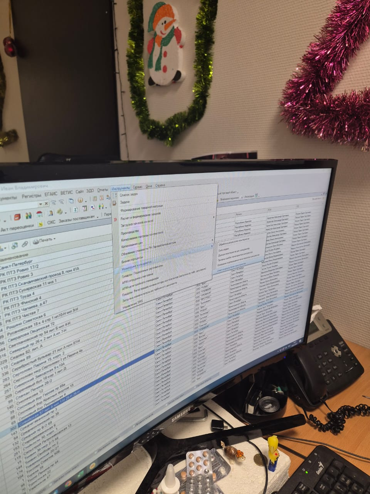
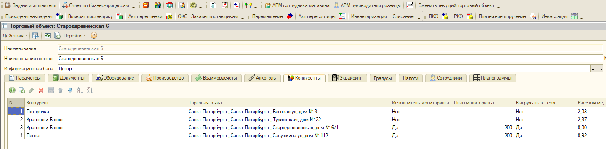

# АРМ мониторинги отчет

[MindMap](https://app.holst.so/board/9a062ccc-6062-454d-bfa0-5cbdbfcd8330)

## Вопросы для интервью
1. Зачем нужно отслеживать?
2. Как сейчас реализован контроль?
3. Где можно посмотреть?
4. Как считается план?
5. Как считается факт?
6. Где план заносите?
7. Есть список конкурентов?
8. Как видите реализацию
9. В каких разрезах нужна информация?
10. Правильно понимаю?

## User & Job Story 
* Я как руководитель магазина хочу иметь возможность посмотреть план/факт выполнения мониторингов в режиме онлайн
* Я как руководитель магазина хочу иметь возможность посмотреть выполнение по каждому конкуренту

## Задача

Коллеги, добрый день!

Прошу добавить в АРМ руководителя магазина отчет по мониторингам в формате:

|  | План| Факт| % |
|----------|----------|----------|----------|
| ТТ | сумма всех планов по конкурентам| факт только по конкурентам где есть план| = факт/план |
| Конкурент | План конкурента (из Торгового объекта, конкуренты)| Факт по конкуренту (во вложении фото откуда берут данные аналитики)| = факт/план |

Пример (данные созданы только для примера):

| ТТ | Точка конкурена| План| Факт| % |
|----------|----------|----------|----------|----------|
| Конкурент |Точка конкурена| | |  |
| Стародеревенская | | 400| 200| 50 % |
| КиБ|Санкт-Петербург г, Санкт-Петербург г, Туристская, дом № 22| 200| 100| 50 % |
| Винлаб|Санкт-Петербург г, Санкт-Петербург г, Стародеревенская, дом № 6/1|  200| 50| 25 % |
| Лента|Санкт-Петербург г, Санкт-Петербург г, Савушкина ул, дом № 112| |  100|  |
| АМ |Санкт-Петербург г, Санкт-Петербург г, Стародеревенская, дом № 6/1| 200| 50| 25 % |

Данные откуда аналитики берут эти данные:

