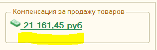
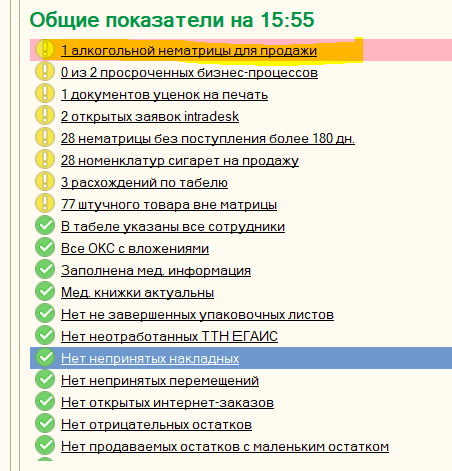
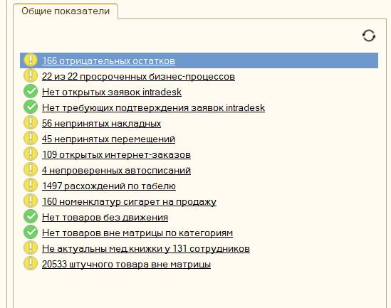

[MindMap](https://app.holst.so/board/9acaebff-49cc-4a97-862d-98a6e88c71c5)

## Вопросы на интервью
1. Подскажите о варианте который видите вы в реализации
2. Расскажите о цели разработки
3. Есть ли подобные решения у конкурентов, анализировали ли их
4. Правильно ли я понимаю, что сумма должна быть отдельной строкой для удобства?
5. Как с нематрицей работаете сейчас?
6. Какие критерии отбора необходимы?
7. В каком формате должна выгружаться сумма
8. Нужен ли нам отдельный столбец для этой премии или оставляем в сумму с ЛП
9. Почему это важно?

## User & Job story
* Я как сотрудник магазина, хочу иметь возможность в любой момент посмотреть сумму заработанного кешбэка
* Я как сотрудник магазина, хочу иметь возможность в любой момент посмотреть список нематрицы
* Я как сотрудник магазина, хочу иметь возможность посчитать возможную выгоду
* Я как руководитель магазинов, хочу иметь возможность посмотреть сводную информацию по заработанному кешбэку на кусте
* Я как руководитель магазинов, хочу иметь возможность в любой момент открыть подробную статистику до СКЮ по каждому магазину
* Я как операционный директор, хочу иметь возможность видеть картину по всей сети
* Я как операционный директор, хочу чтобы сумма кешбэка попадала в авторассчет ЗП прибавляясь к ЛП и следовала такой же логике распределения

  ## Задача

  Коллеги, добрый день!

  Необходимо реализовать:
  1) Вывод суммы в АРМ сотрудника магазина суммы кешбэка
  2) Отчет в АРМ руководителя магазина по нематрицы
  3) Добавить сумму кешбэка в зарплатный проект

1) Вывод суммы по ТТ должен быть строкой под суммой ЛП:

2) Отчет в АРМ руководителя магазина
Необходимо добавить отчет формата:
РГМ, ТТ, сумма заработанного кешбэка
Также должна быть возможность развернуть до СКЮ

СКЮ должны быть все имеющиеся в показателе на месяц

Добавить отчет можно также как в АРМ сотрудника магазина, в общие показатели:

Сумму кешбэка берем аналогично из АРМ сотрудника магазина

3) Добавить сумму кешбэка в Зарплатный проект

Новая формула ЛП:

АТЗ, ЗУМ, Группа запуска - от 95% ((Сумма компенсации за продажу товаров + сумма кешбэка за алкогольную 
нематрицу) - сумма премии ЗАВ и ЗАВ и.о.)/Сумма часов без ЗАВ и ЗАВ и.о. * факт часов

ЗАВ и ЗАВ ИО от 95%: (Сумма из АРМ сотрудника "Компенсация за продажу товаров" + Сумма кешбэка за алкогольную 
нематрицу) * 30% * Выработку сотрудника (макс выработка 100%)